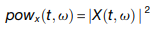
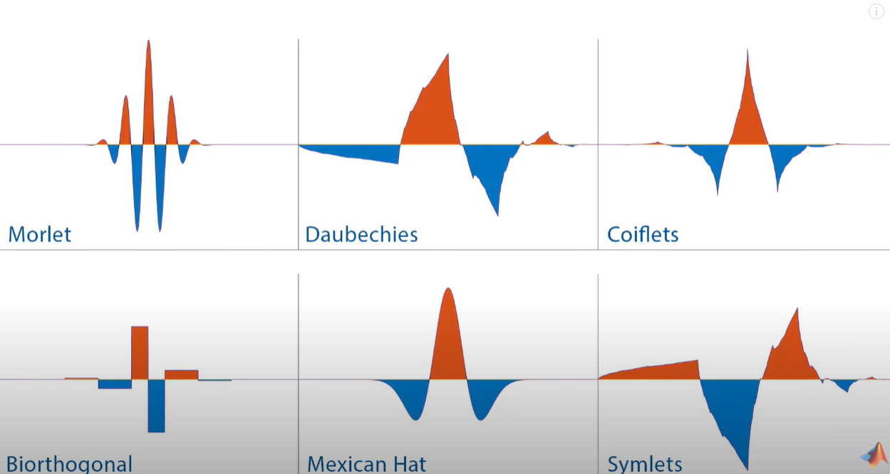
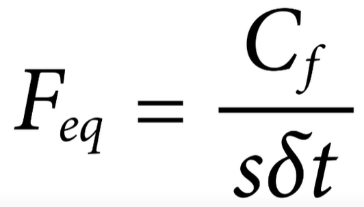
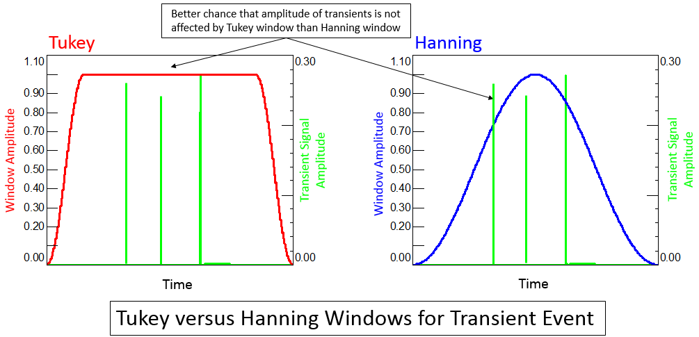
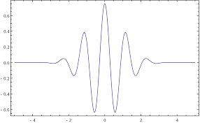

This document is for the data-analysis project of Simon's monkey dataset (`iontophoresis` & `non-iontophoresis`), mainly **LFP**-oriented.

# Animals
## [Non-iontophoresis](./General/Non-ion_Ref/Jacob2014-Neuron.pdf)
Two rhesus monkey, named **R** and **W**.<br>
(**R** is a little more hardworking and better in performance than **W**)
### Surgery
Chronically implanted recording chambers over principal sulcus of the `lateral PFC` and the `ventral Intraparietal (VIP)`. MRI-guided and stereotaxically measured.
### Electrophysiology
8* 1MΩ glass-coated tungsten `钨` electrodes per chamber. Acutely inserted 30 minutes before each session.
Both `extracellular single unit spiking` and `LFPs.` Hardware band-passed.
To account for neuronal response latencies in PFC and Parietal, starting and end points of all trial epochs were offset by **100ms** for analysis. (Neurophysiological time needed for visual information to reach the associative cortics)

## [Iontophoresis](./General/Ion_Ref/Jacob-2016-NatCom.pdf)
### Electrophysiology:
**3** tungsten-in-glass electrodes, 2 pipettes;
### Drug application


- Randomly recorded stable and well-isolated neurons.
- VIP: at fundus of IPS, electrodes through IPS to depth of 9-13mm below cortical surface.
- `MAP system`: extract timestamps of trial events and APs.

## ***Behavioral***
Switch from typical delay match-to-numerosity task with gradually introduced distractors.


p.s.: `Delay1`: Test5; `Delay2`: Test8; `Last response`: Test7.

### CORTEX test number:


### Stimuli: 
[`share/XUANYU/MONKEY/Non-iontophoresis/code/Cortex/INHIB_R.ITM`](./code/Cortex/INHIB_R.ITM)<br>
* **75** images per numerosity (`n01`-`n75`)
* **25** possible positions x **5** possible sizes
* sample numerosity n: `1-4`
* 120 standard conditions: 75x4 figures named 101-475 [`share/XUANYU/MONKEY/Non-iontophoresis/code/Cortex/generate_dots_random.m`](./code/Cortex/generate_dots_random.m)
* 120 control conditions: area and mean distance fixed; 75x4 figures named 501-875 [`share/XUANYU/MONKEY/Non-iontophoresis/code/Cortex/generate_dots_control`](./code/Cortex/generate_dots_control.m)
 
 
### Condition/KOND:
[`share/XUANYU/MONKEY/Non-iontophoresis/code/Cortex/INHIB_R.CON`](./code/Cortex/INHIB_R.CON)<br>
* The hundreds digit marks the numerosity (101-475)
* **1-100**, empty conditions;
* **120** conditions for standard stimuli; **120** for control (?), altogether 101-340: 240 conditions;
* Every **15** switch between match and non-match trial (with/without non-match stimuli before the match stimuli);
* Every **5** randomizing the distractor (non + n=1-4)
* ***4 sample numerosity * (1+4) distractor * (3 random match + 3 non-match numerosity)*** = 120 conditions
    
### Response code (*Important*):
* e.g. **`1210`**: 
    * `1`, sample numerosity, 1-4
    * `2`, distractor numerosity, 0-4, 0(no distractor)
    * `1`, first test numerosity, 1-4, is a match trial if equal to sample
    * `0`, standard stimuli(0) or control stimuli(1)

### Error code

* `0`, correct / free reward: release bar after a delay from the presentation of match stimuli 
* `6`, mistake: only in a non-match trial, release bar while presenting non-match test
* `1`, missing: possible in all test trials, no response until the end of match stimuli presentation
* `5`, early response: bar release during match_still_waiting delay
* `4`, no fixation: fail to fixate and initiate the trial during wait_fixation
* `8`, bar up: fail to hold the bar to initiate during wait_bar
* `3`, bad fixation: break fixation or release bar during the trial, not in response period

### Event marker code

p.s.: 'Strobed': software catches all relevant information at each event marker timestamp, like a flashlight.


# Analysis
## Raw Data
Storage of `.nex` and `nexctx` at these locations:
    * `share/Daniel/MONKEY/MONKEYS_DISTRACTOR/data` 
    * `share/XUANYU/MONKEY/Non-iontophoresis/data`
    * `Onedrive\Lab works\JacobLab-MonkeyData\Git\JacobLabMonkey\data`
    
### file type: 
#### .plx
- `.plx`, obtain from [**MAP** Analog data acquisition system](https://plexon.com/products/map-data-acquisition-system-plexon/) , Plexon Inc. Storage at `share/Daniel/MONKEY/MONKEYS_DISTRACTOR/Simon/Plexon`<br>
    No need to refer to.

#### .nex
- **`.nex`**, fieldtrip [file type](https://en.wikipedia.org/wiki/Nexus_file), per monkey per session; can be accessed with `readNexFile.m`
- Filename formatting:<br>
> 'R120410-03_lfp': 'R'(monkey name) + '120410'(date) + '-03'(not relevant, file log) + '_lfp'(contain LFP data)
- Data structure:
```
          struct with fields:

         version: 104
         comment: [1×0 char]
            freq: 40000        % sampling rate
            tbeg: 0            % recording start timestamp
            tend: 6.6671e+03   % recording end timestamp, t_all
          events: {3×1 cell}   % non-relevant, on&off events
         markers: {[1×1 struct]} % behavior markers and timestemps
         neurons: {k×1 cell}  % PCA identified neurons
        contvars: {i×1 cell} % LFP per channel
.
```
 - `nexfile.markers`: 1x1 struct
    * `nexfile.markers{1,1}.values{1,1}.strings`: [event code](file://), _n_x1 cells
    * `nexfile.markers{1,1}.timestamps`: corresponding timestamps of each event code (of the same length), _n_x1 double
 - `nexfile.neurons`: identified k neurons from *PCA* analysis of all channels; _k_x1 cell
    * `nexfile.neurons{k,1}.name`: neuron code:
> e.g. 'sig009a': 'sig0' + '09'(electrode name) + 'a'(PCA component sequence, a/b/c...)

        read as *first neuron at 09 electrode*
    * `nexfile.neurons{k,1}.timestamps`: spiking timestamp of the *k*th neuron, *ns*x1 double
 - `nexfile.contvars`: continous variable, i.e. LFP per channel
    * up to 16 channels (*1-8 PFC, 9-16 VIP*)
    * make sure to **always check `name`** since there can be electrodes missing
    * `nexfile.contvars{i,1}.name`: electrode code<br>
> e.g. 'AD04', 'AD'(analog data) + '04'(electrode 4);
    * `nexfile.contvars{i,1}.data`: t = *t_all*; **LFP** data
 - Electordes are labeled by Plexon systems in either `sig...` or `AD...` for LFPs
 - Spikes are sampled at **40kHz**, no waveform stored; LFP/Analog Data at **1000Hz**
 
#### nexctx    
- `nexctx`, *.mat* file, Simon's summary on spike & event timestamps, no LFPs.<br>


## Single Unit spike
### Selection
1. over 1 spike/s;
2. recorded for at least 1 correct trial in all 20 conditions (4 sample x 5 distractor);
3. modulate firing rate in the course of trial (1-way ANOVA across dixation, sample ,1st memory, distractor, 2nd memory);

## [LFP](./General/Non-ion_Ref/Jacob2018-Neuron.pdf)
1. mean-centered
2. filtered for line noise removal; `4th order Butterworth notch at 50 Hz and first and second harmonics`
3. rereferenced to average of all prefrontal and parietal electrodes winin a session
4. ERP of stimulus presentation removed (trial average) from individual trials; performed separately for all analyzed trial subsets

### spectral transformation
Temporal-frequency domain ***X*** (of single LFP trials or binary spike trains) estimated by convolving signal ***x*** with complex kernels ***k***: [Hanning-taper complex sinusoids](https://www.fieldtriptoolbox.org/tutorial/timefrequencyanalysis/#hanning-taper-frequency-dependent-window-length)


## FieldTrip Toolbox
### Intro:
- FieldTrip should not be added to MATLAB path with subfolder, may cause conflict with, e.g. SPM

### ft_definetrial
- The `Configuration` structure: **cfg**, manipulating how functions behave.

```    
    cfg1                         = [];
    cfg1.dataset                 = 'Subject01.ds';
    cfg1.trialdef.eventtype      = 'backpanel trigger';
    cfg1.trialdef.eventvalue     = 3; % the value of the stimulus trigger for fully incongruent (FIC).
    cfg1.trialdef.prestim        = 1;
    cfg1.trialdef.poststim       = 2;
```    
- cfg = ft_definetrial(cfg). timestamps for selected marker was extracted for each trial.

## ***Analysis Pipeline***
### User-define trial function
* demo see [mytrialfun](./code/Training/ft_demo/mytrialfun.m)
* Draft version (2020.11.06) see [trialfun_training] (.code/Training/trialfun_training.m)
* Final development:

### Preprocessing:
Pipeline:
* Draft version for training [RewardLFPs_pipeline](./code/Training/RewardLFPs_pipeline.m)
* Daniel's [DefineTrl](file:///Z:/DANIEL/MONKEY/MONKEYS_DISTRACTOR/code/DefineTrl.m)
1. reading data `cfg.dataset`
2. segmenting (by trial): `cfg.trialfun = `[`trailfun_training`](./code/Training/trialfun_training.m) (by default trialfun_general)
3. temporal filtering `ft_preprocessing` (?)
4. artifact rejection (visualization, ICA...)
5. (optionally referencing)

* ft_preprocessing resulting in [data structure](https://www.fieldtriptoolbox.org/walkthrough/#data-structure-in-fieldtrip), containing:
1. `data.time`: relative time point for each channel, for t axis
2. `data.trial`: `1 x trl` Cell, each Cell: Channel x Signal (No.27-42 channel: `AO01-16` LFP)

* visualize the raw data for inspection: `ft_databrowser`

### Frequency Analysis
* Check Fieldtrip documents [Frequency Analysis](https://www.fieldtriptoolbox.org/walkthrough/#frequency-analysis)
* Methods: e.g. 'mtmconvol' Daniel used for ionto & non-ionto processing
    - `mtmfft`: fast fourier transform, specify `foi` (frequencies of interest), *average frequency-content* (no time axis)
    - `mtmconvol`: *time-freqency*, sliding **wavelet** (defined by `cfg.tf_timwin`; windowed/taped; FFT of raw data and wavelet, multiplied with each other, inverse Fourier 
* **Frequencies of interest (FOI): 2-128Hz; steps of 2<sup>1/8</sup>; kernal width 3**
* power: 
* `ft_freqanalysis` leads to `data.powspctrm` field (for `mtmconvol`, Channel x foi x toi; `mtmfft`, Channel x foi)
* `mtm`: multiple-taper-methods
#### ***Parameters***
```
% 20150918: Constantin suggested to use powers of 2 as frequencies width
% individual frequencies spaced by 1/4 or 1/8 octaves, time windows of at least 3 （Cycles per time window）
% cycles and step sizes of 10 ms
% % 39 logarithmically spaced frequencies (Siegel et al. 2009):
```
    
#### **Wavelet**: 
* [Introduction](https://www.eecis.udel.edu/~amer/CISC651/IEEEwavelet.pdf)
    - process data at different scales/resolutions; large window leads to gross features, small to details;
    - well-suited for data with sharp discontinuities
    - basis function: e.g. sin/cos for Fourier, orthogonal and constructing
    - scale-varying basis function:
    - Wavelets: localized in time and frequency
    
    - scaling
        - band-passed in frequency domain: center-frequency (*Cf*), wavelet scale (*s*), sampling interval (*δt*)
    
    - shifting
    - vanishing moments:
    - taper: **Hanning window** 
        - overlapping window suggested to avoid losing data between windows
        - Gaussian taper , infinite width
        - Hanning taper: fully confined to specific width
* Both data and wavelet Fourier transformed, and convolve in the frequency domain then inverst fourier transformed; convolution of the complex wavelet with the data, computationally efficient.
* windowed fourier (**WFT**): weight function, e.g. square wave segemented freq-temporal window. 'Fixed' resolution
* Continuous Wavelet Transorm (**CWT**): time-frequency analysis, filtering;
* Discrete (**DWT**): denoising, compression (figure)


#### **Superlet**
* 


### plot layout
`ft_singleplotTFR` or `imagesc(squeeze...)`. [Tutorial](https://www.fieldtriptoolbox.org/tutorial/plotting/)

### trial screening
see folder `./code/0.TrialScreening`


### Notes：
* Always check the channel names, there can be some LFP channels not working or not recorded, e.g. `R120508-02_lfp.nex`
