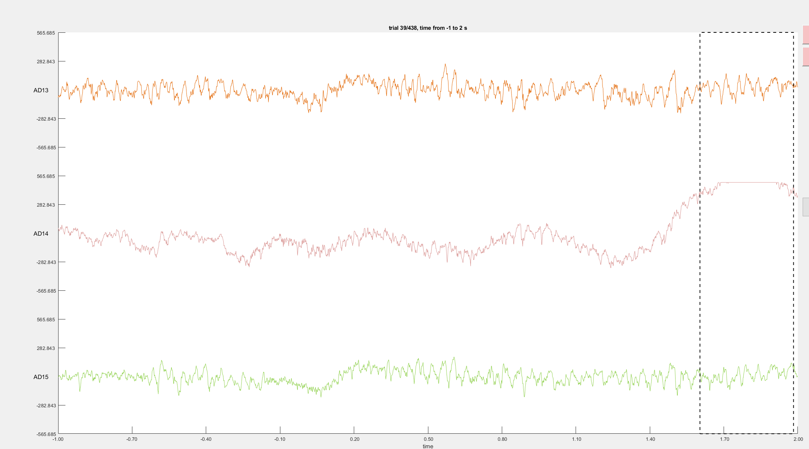
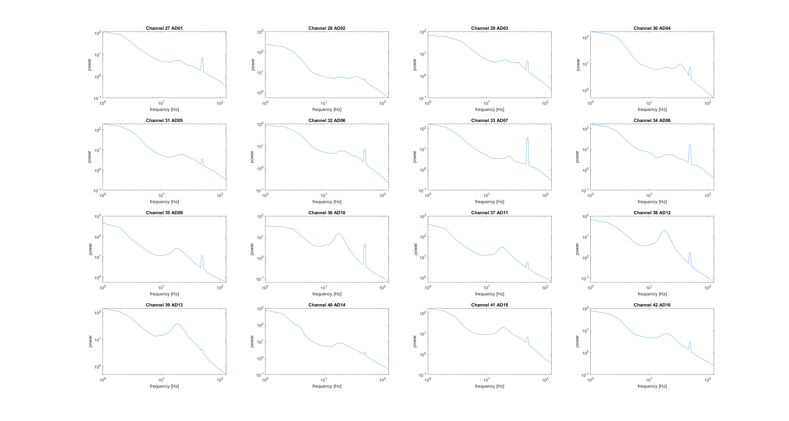
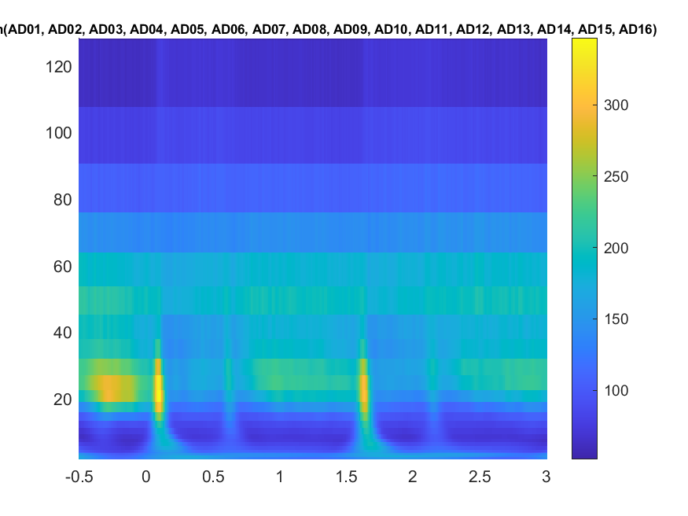
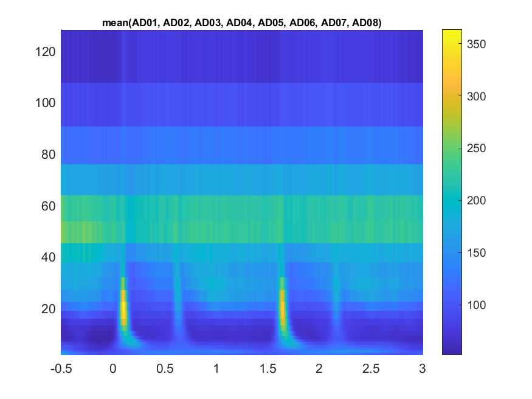
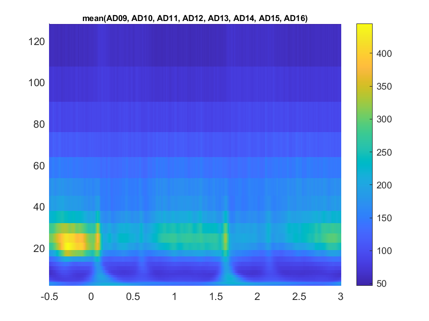
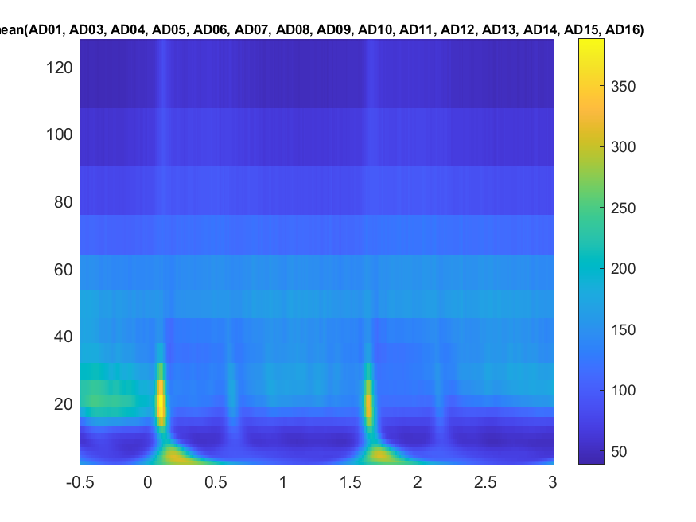
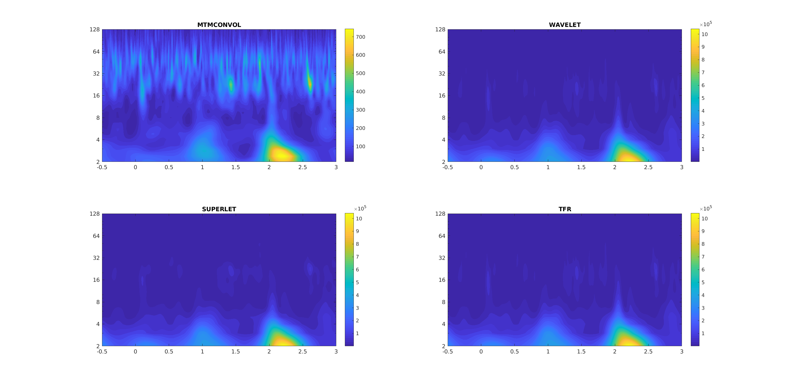
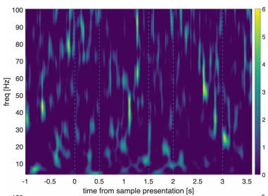

# Working log

## 2020.11.03
* Discussion with Danial and Simon on project overview and schedule
* Download `Neuroexplorer demo` for a trial on viewing the raw data 
* Meeting with Simon and Daniel, went through the `.nex` & `.ctx` & `.TM1`(Timing script) files

## 2020.11.04
* Uninstall `Neuroexplorer demo`, get its MATLAB toolbox `C:\Program Files\MATLAB\R2020a\toolbox\nexreader` (*Free*)
* Summarize the discussion (11.03) in `/Git/JacobLabMonkey/README.m`
* backup raw data (`.nex` and `.ctx`) at `share/XUANYU/MONKEY/Non-iontophoresis/data/raw_nex` and github

## 2020.11.05
* md file on behavior markers lost, unknown reason; but got paper record backup
* make sure commit everyday for the changes
* keep on with the condition codes, response codes, error codes
* now clear with the task structure: [document scan](./General/TrialMarkerDescription.pdf)
* start learning fieldtrip data structure
* try to do trial segmentation on rewards, only for test trials, excluding the free-rewards. See [pipeline script](./code/Training/RewardLFPs-pipeline.m)

## 2020.11.06
* [trial function](./code/Training/trialfun_training.m) (for segmentation) done, include variables:
    - eventvalue: event E to align, e.g. 3 for reward, 25 for sample stim onset
    - pretrl: time (sec) before E included in analysis
    - posttrl: time (sec) after E for analysis
    - triallen: triallength start from E (kind of unnecessary considering pre- and posttrl should have already define the length)
    - errorcode: use for select trials based on the response correction
    - stimtype: select trial based on standard/controlled stimulus
    - sampnum: select trial based on sample numerosity
    - distnum: select based on distractor numerosity
* include the notes in `README.md`
* *Are there artifacts that should be removed?* No physiological-event relevant noise, e.g. EOG
* Preprocessing with what parameter? bandpass? 
> mean-centered, filtered for line noise removal... and re-referenced to the average of all prefrontal and parietal electrodes within a session, unless stated otherwise... ERP subtraction was performed separately for all analyzed trial subsets
* ERP calculation done, see [figure](./code/Training/ERPs/R120410_reward.png)

## 2020.11.09
* try visualization of the raw data for inspection purpose `ft_databrowser`
    - no remarkable trends or artifacts in LFP
    - may try ICA later;
* <s>***Question***</s>: 
    - A ceiling artifact in AD14, `R120410`, correct trial 49;
    - Channel AD14 not stable troughout the whole session
    - What to do?
    - Daniel haven't screen for these artifacts (saturation of data acquisition); may need eyeballing for excluding certain trials



* stepping into the [frequency analysis](https://www.fieldtriptoolbox.org/walkthrough/#frequency-analysis)


## 2020.11.10
* ***Question*** sampling rate: 40kHz for what and 1kHz for what?

## 2020.11.11
* <s>***Question***</s> Why there're NaNs in the spectral data? Solution: fieldname 'channel' not 'Channel'; a wrong fieldname will be ignored by FieldTrip without warning.
* ***Question*** try `mtmfft`, foilim [2 128] return 517 values, why? Suppose to be averaging across the range
* mtmfft with the following setup result in spectra:
```
cfg_spect.output = 'pow';
cfg_spect.method = 'mtmfft';
cfg_spect.pad = 'nextpow2';
cfg_spect.taper = 'dpss';
cfg_spect.foi = [1:128];
cfg_spect.tapsmofrq = [2]; % for fft;
```

* get gollum for editing the lab wiki. [Installation guide](https://github.com/gollum/gollum/wiki/Installation) not necessary, permission problem, now have access to edit

## 2020.11.12
* Plot powerplots: 
1. ***all*** channels aligned to sample onset (25)

2. ***PFC*** channels aligned to sample onset (25)

3. ***VIP*** channels aligned to sample onset (25)

* try a data session with missing channel *AD02*: (*R120508*)

* try to add titles, labels to the singleplotTFR
* ***Question***: VIP pre-sample ramp? small peaks following delay period?
* ***Question*** bsfreq in ft_preprocessing? what is it?

## 2020.11.17
* Discussed a little about the training powerplots with Simon, acceptable and ready to enter the next stage
* working on getting guest accounts for the lab, not solved

## 2020.11.18
* Use Shirui's account on the Analysis PC, done.
* start to do preprocessing:
  - [preprocessing_201118](./code/1.Preprocessing/preprocessing_201118.m)
  - [trialfun_201118](./code/1.Preprocessing/trialfun_201118.m) copied from `./code/Training/trialfun_training.m`
* develop trial screening protocol:
  - [TrialEyeballing_201118](./code/0.TrialScreening/TrialEyeballing_201118.m)
* Alpha connection is bad: resetting already established connections from time to time
    - a hack: ssh through beta then through alpha
    
## 2020.11.19
* Start trial screening:
    - Protocol: run [TrialEyeballing_201118](./code/0.TrialScreening/TrialEyeballing_201118.m)
    - each session was break apart with a `pause`
    - wrong trials note down at [TrialScreening](./data/TrialScreening_201118/badtrials.md)
    
## 2020.11.20
* plot single trial for review:


    - range of data: [-499.7559 499.7559]; saturation if exceeding the range
    
* Auto detect saturations:
    - `data_prep` saved at `./data/TrialScreening_201118/*.mat`
    - badtrial figures at `./data/TrialScreening_201118/.png`; name formatting: session.trial.png
    
## 2020.11.21
* error trials got, only observed in 2 sessions (i=[1 4], name = ['R120410' 'R120413'])
* further eyeballing: kick out trials with saturation in time window [0 3000] after event *25* (sample onset)
    - 1.[1 16 21 22 36 40 54 58 89], 9 trials, all in channel `AD14`
    - 4.[5 7 10 15 16 23 26 27 32 33 39 45 47 48 49 50 52 54 56 57 59 60 64 65 66 67 76 78 80 82 83 95 97 99 104 105 106 118 128 142 145 146 148 151 153 155 157 160 162 165 174 175 176 177 180 182 183 185 187 188 190 193 194 195 196 197 198 199 200 201 202 203 204 205 206 207 208 209 210 211 212 213 214 215 216 217 218 219 220 223 226 227 228 229 234 235 237 238 242 243 244 247 248 249 250 251 254 257 258 259 261 263 265 266 269 271 272 274 275 276 277], 121 trials, all in channel `AD11`, consider exclude the whole channel

## 2020.11.23
* Check Superlet method. It's in Daniels' github

## 2020.11.24
* continue with the Superlet method.
* Issue: Daniel's development on Superlet for Fieldtrip has not been finished. There seems scaling issue (see email and `./General/Methods/`)
* plot with [contourf](https://mailman.science.ru.nl/pipermail/fieldtrip/2015-July/035240.html)
* Power plots with different methods in example trials, averaged across electrodes: `./code/Training/ft_superlet/Plots`
e.g.: 
* MTMCONVOL method result in 
smaller values in power, especially for lower frequencies. Might be normalized across frequency bands? (i.e. uV<sup>2</sup>/Hz, 1/f rule considered)
* ***Question*** what's the unit for the power values in each bin? e.g. in wavelet analysis? Also mine is different from Daniel's, also because of normalization?


# To-do list:
* (x) define a trial structure for the data, arrage that for whole-dataset analysis (ft_redefinetrial)
* (x) artifact screening (for trials / electrodes)
* () familiarize with superlet method

# Ideas to go
* Item specific bursts / burst identities:
    - spatial outlay: weighted in different electrodes
    - sorted by spiking neurons
* Dopamine ionophoresis effect